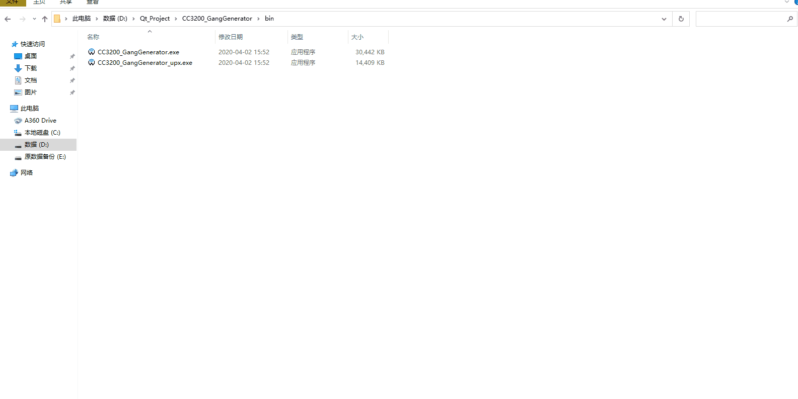

# 简介
本程序的主要功能是调用TI官方的工具生成gangimage，用于直接对CC3200的SPI Flash进行烧写。

# 说明

* 本程序的输入是一个文件夹，其中含有若干文件，生成gangimage时会自动遍历目录。
* 本程序输出的文件夹中的output有可直接用于烧写SPI Flash的Programming.bin文件。

> 例：生成一个含有mcuimg.bin文件的gang image

>  
